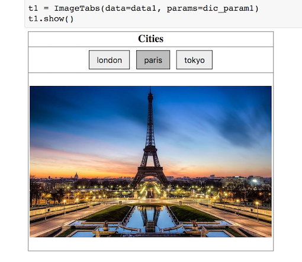

# Display Image Tabs

This is a convenience Python package to display image tabs in a Jupyter notebook.



## 1 - Install

From terminal

```bash
pip install display_image_tabs
```


## 2 - User Guide

See the [demo notebook](https://nbviewer.jupyter.org/github/oscar6echo/notebook-image-tabs/blob/master/demo_image_tabs.ipynb).

The data must be input as follows

```Python
data = [
    # list of
    # name, image as path
    ['london', 'img/london.jpg'],
    # name, image as url
    ['paris', 'http://path/to/an/image.png'],
    # name, image as base64 string
    ['tokyo', '/9j/4AAQSkZJRgABAQAAAQAB...etc'],
]
```

The layout params are as follows

```Python
# all params are CSS variables
# default values below
dic_param = {
    # border around tab and image container
    'borderPx': 0, # border in pixel
    'borderColor': 'gray', # border color
    # tab is div on top of image container
    'tabBackgroundColor': 'white', # backgroud-color
    # one button for each data item
    'buttonMargin': 5, # margin in pixel
    'buttonPaddingVert': 12, # padding vertical in px
    'buttonPaddingHori': 7, # padding horizontal in px
    'buttonBorderColor': 'black', # border color
    # one image in image container displayed if button is active
    'imageWidthPerCent': 99, # width in %
    # image container and tab width
    'width': None, # div will default to 100%
    # image container height
    'height': None, # div will size automatically
    # button selected at start 0-indexed
    'selection': 0,
    # button colors base / hover / active
    'buttonColorBase': '#eeeeee',
    'buttonColorHover': '#dddddd',
    'buttonColorActive': '#bdbdbd',
}
```

To display the image tabs

```Python
# create object
t = ImageTabs(data=data, params=dic_param)

# display
t.show()
```

